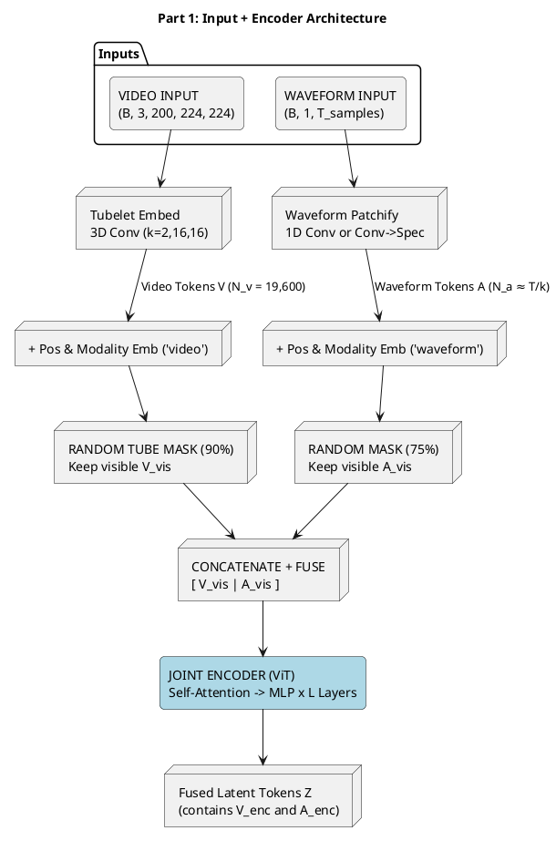
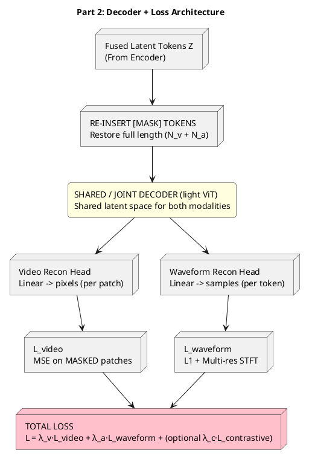

# Pre-Training (stage-2 in pipeline) to learn cross-modal representation

## Input + Encoder

```plantuml
@startuml
skinparam RoundCorner 10
skinparam ComponentStyle rectangle

title Part 1: Input + Encoder Architecture

package "Inputs" {
  [VIDEO INPUT\n(B, 3, 200, 224, 224)] as V_IN
  [WAVEFORM INPUT\n(B, 1, T_samples)] as A_IN
}

node "Tubelet Embed\n3D Conv (k=2,16,16)" as V_EMB
node "Waveform Patchify\n1D Conv or Conv->Spec" as A_EMB

V_IN --> V_EMB
A_IN --> A_EMB

node "+ Pos & Modality Emb ('video')" as V_POS
node "+ Pos & Modality Emb ('waveform')" as A_POS

V_EMB --> V_POS : Video Tokens V (N_v = 19,600)
A_EMB --> A_POS : Waveform Tokens A (N_a ≈ T/k)

node "RANDOM TUBE MASK (90%)\nKeep visible V_vis" as V_MASK
node "RANDOM MASK (75%)\nKeep visible A_vis" as A_MASK

V_POS --> V_MASK
A_POS --> A_MASK

node "CONCATENATE + FUSE\n[ V_vis | A_vis ]" as FUSE
V_MASK --> FUSE
A_MASK --> FUSE

rectangle "JOINT ENCODER (ViT)\nSelf-Attention -> MLP x L Layers" as ENCODER #LightBlue
FUSE --> ENCODER

node "Fused Latent Tokens Z\n(contains V_enc and A_enc)" as LATENT
ENCODER --> LATENT

@enduml
```

## Decoder + Loss

```plantuml
@startuml
skinparam RoundCorner 10
skinparam ComponentStyle rectangle

title Part 2: Decoder + Loss Architecture

node "Fused Latent Tokens Z\n(From Encoder)" as LATENT
node "RE-INSERT [MASK] TOKENS\nRestore full length (N_v + N_a)" as REINSERT

LATENT --> REINSERT

rectangle "SHARED / JOINT DECODER (light ViT)\nShared latent space for both modalities" as DECODER #LightYellow
REINSERT --> DECODER

node "Video Recon Head\nLinear -> pixels (per patch)" as V_HEAD
node "Waveform Recon Head\nLinear -> samples (per token)" as A_HEAD

DECODER --> V_HEAD
DECODER --> A_HEAD

node "L_video\nMSE on MASKED patches" as V_LOSS
node "L_waveform\nL1 + Multi-res STFT" as A_LOSS

V_HEAD --> V_LOSS
A_HEAD --> A_LOSS

node "TOTAL LOSS\nL = λ_v·L_video + λ_a·L_waveform + (optional λ_c·L_contrastive)" as TOTAL_LOSS #Pink

V_LOSS --> TOTAL_LOSS
A_LOSS --> TOTAL_LOSS

@enduml
```
