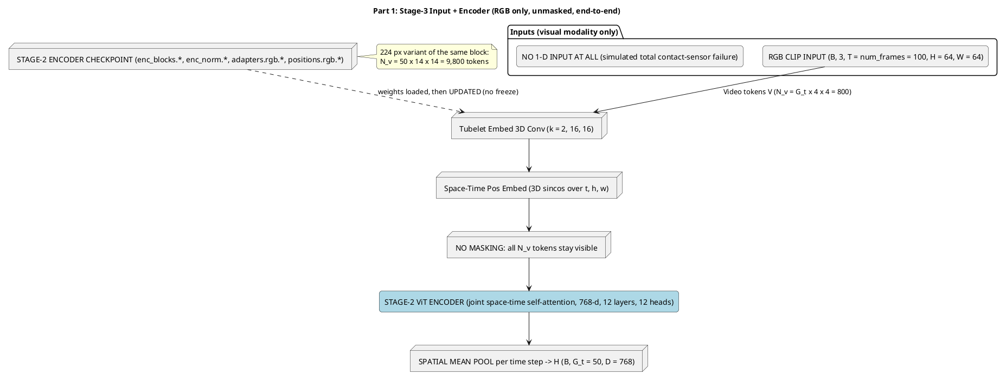
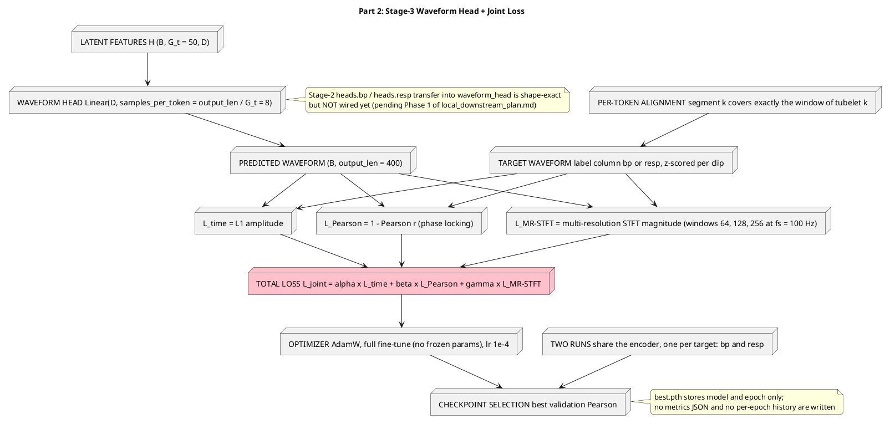
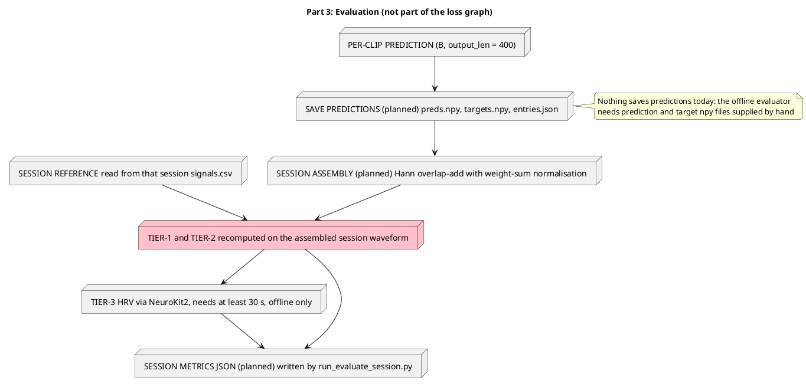

# Fine-Tuning (stage-3 in pipeline) to reconstruct the targeted waveform

> Stage 3 is the deployment condition: the contact sensor is assumed to have failed
> completely, so only RGB video enters the model. The Stage-2 encoder is fine-tuned
> end to end (nothing is frozen) and one lightweight regression head emits the whole
> waveform window. Two independent runs share that encoder, one per target waveform
> (`bp`, `resp`). No masking is applied anywhere in this stage.
>
> Companion documents: `architecture.md` holds the Stage-2 pre-training diagrams
> (input + encoder, decoder + loss); `local_downstream_plan.md` is the setup record for
> the two local 64 px runs. Numbers below are the **local 64 px** geometry with the
> 224 px variant called out in a note.

## Input + Encoder

## Head + Joint Loss

## Evaluation (in-training per clip, offline per session)

## Notes on correctness

* **RGB only.** `streams: rgb` plus `use_tir: false`, so the dataset yields a
  `[B, 3, T, H, W]` clip and `MultiModalWaveformRegressor` tokenizes that one stream.
  The 1-D waveform exists solely as the regression target, which is how the
  "complete contact-sensor failure" is simulated (by omission, not by masking).
* **No masking.** `forward(self, x)` has no mask argument and raises unless the
  tokenized count equals `n_visual`, i.e. the full token grid is always fed, in both
  training and evaluation.
* **End-to-end.** `freeze_encoder()` exists but is never called; the optimizer covers
  every parameter, so `enc_blocks`, `enc_norm`, `adapters.rgb` and `positions.rgb` are
  all updated alongside the head.
* **What is persisted.** Only `checkpoints/checkpoint-NNNN.pth`, `latest_checkpoint.txt`
  and `best.pth` (model + epoch, plus the training `args` inside each checkpoint). The
  Tier-1/2 numbers are printed per epoch and never written to disk, there is no metrics
  JSON and no prediction dump; Tier-3 is offline and needs saved predictions, which no
  runner produces today.
* **Pending items shown as notes.** The Stage-2 head transfer, the warmup + cosine LR
  schedule, the prediction dump, the session-level evaluation runner, and the Tier-3
  guard (2 s today, needs 30 s) are not implemented yet.
* **Rendering.** Labels avoid the creole traps known in `architecture.md`: no `--`
  pairs, no `>>`, no angle brackets. Validate with
  `java -jar /tmp/plantuml.jar -checkonly <file>.puml` (silent means OK).
