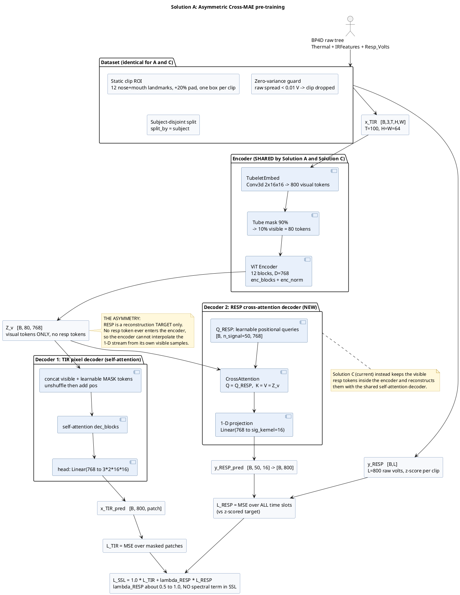
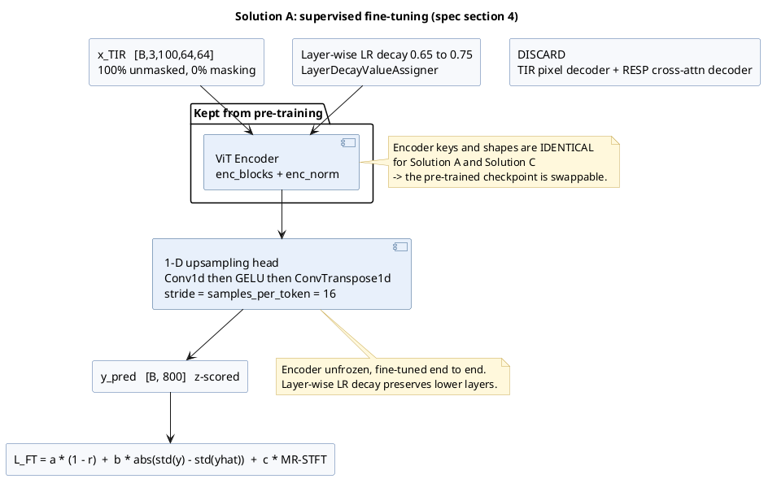
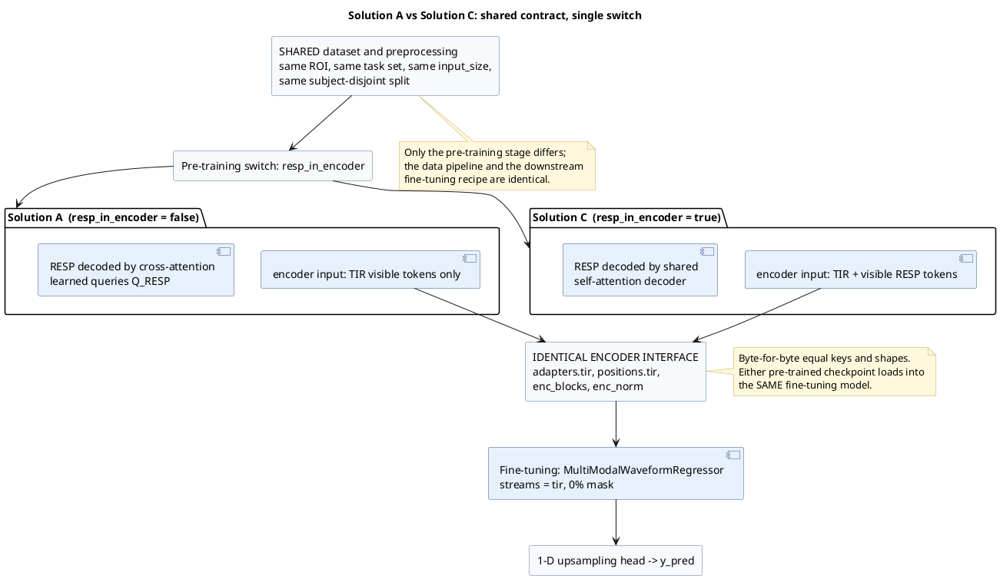

# Solution A — Asymmetric Cross-MAE: architecture diagrams

PlantUML source for **Solution A (Modality-Isolated / Asymmetric Cross-MAE)**, the
asymmetric variant of the current shared-encoder design (**Solution C**).

Design of record: `code/design/SolutionA_asymCrossMAE.md`.
Both solutions share one dataset and one encoder interface; they differ **only** in the
pre-training stage (see diagram 3).

---

## 1. SSL pre-training — Solution A (resp tokens excluded from the encoder)

---

## 2. Supervised fine-tuning — discard decoders, keep the encoder

---

## 3. Solution A vs Solution C — differ only in pre-training

---

## Notes

- `\n` inside quoted labels is a literal backslash-n (PlantUML line break), matching the
  convention used in `code/design/SolutionC_EarlyTokenMixing_stage2.md` and
  `code/design/SolutionC_EarlyTokenMixing_stage3.md`.
- Validate with:
  `curl -sSL -o /tmp/plantuml.jar https://github.com/plantuml/plantuml/releases/download/v1.2024.7/plantuml-1.2024.7.jar`
  then `java -jar /tmp/plantuml.jar -checkonly <block>.puml` and `-tpng` to render.
- Solution C is the current shipped design (`configs/pretrain/stage2_local_tir_roi_resp.yaml`);
  Solution A is the planned twin (`configs/pretrain/stage2_local_tir_roi_crossmae.yaml`).
